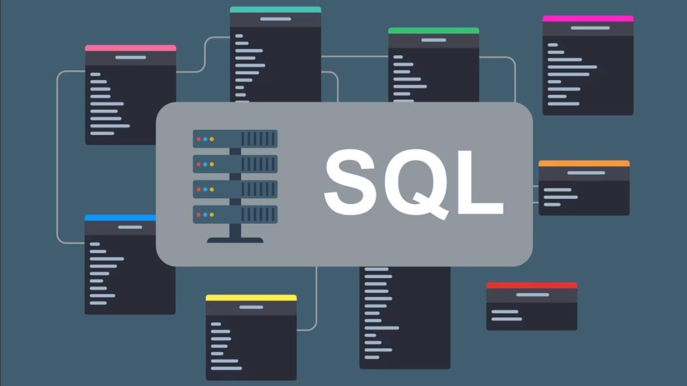

<p align="center">

</p>
 
 # SQL DDL with Data Manipulation
## Table of Contents
- [Overview](#overview)
- [Breakdown](#breakdown)
- [Code Example](#code-example)
- [Project Goals](#project-goals)
- [Contributing](#contributing)
- [Contact](#contact)

## Overview
This project demonstrates the creation and manipulation of a relational database schema using SQL. It covers DDL (Data Definition Language) for schema creation, data loading with DML (Data Manipulation Language), and basic querying for information retrieval.

## Breakdown
***1. Schema Design (DDL)***
- Defines the database schema using ```CREATE TABLE``` statements.
- Implements primary and foreign keys to ensure data integrity.
- Utilizes various data types to represent different attributes (e.g., INT, VARCHAR, DATE, DECIMAL).
- Includes ```DROP TABLE``` statements to reset the schema for a fresh start.<br>

***2. Data Loading (DML)***
- Uses INSERT INTO statements to populate the tables with sample data.
- Demonstrates data insertion across different tables, including multiple rows.
- Employs TO_DATE function to format dates for insertion.<br>

***3. Data Querying (DQL)***
- Uses ```SELECT``` statements to retrieve specific data from the database. 
- Includes ```ORDER BY``` clauses to arrange results in a logical order. 
- Applies ```WHERE``` clause to filter results based on specific criteria.<be>

***4. Data Modification***
- Demonstrates ```UPDATE``` statement for changing data in a table.
- Utilizes ```DELETE``` statement to remove records from a table.

## Code Example
DDL
```
CREATE TABLE Customer (
CustomerID INT PRIMARY KEY,
Name VARCHAR(30) NOT NULL,
Address VARCHAR(255)
);
```
DML
```
INSERT INTO Customer (CustomerID, Name, Address, Phone)
VALUES (1, 'Paul', '123 Main St', '555-1234');
```
DQL
```
SELECT Name, CustomerID, Address
FROM Customer
ORDER BY CustomerID;
```

## Project Goals
- Showcase proficiency in SQL DDL and DML. 
- Implement a relational database schema with multiple tables. 
- Load sample data into the database for demonstration purposes. 
- Execute basic SQL queries to retrieve and manipulate data.

## Contributing
Contributions are welcome! Feel free to fork this repository, make your changes, and submit a pull request.


## Contact
If you have any questions or suggestions, feel free to contact me at:

**Vadym Kharchenko**  
Email: vadym.kharchenko@yahoo.com

